# PAT Controller – Runtime & Architecture Overview

This document provides a consolidated engineering overview of the PAT Controller system, including runtime model, layered architecture, processes, threads, devices, transports, state-machine behavior, and control-loop execution. It includes diagrams to support system comprehension and future development.

---

# 1. System Overview

The PAT Controller orchestrates sensors, actuators, and peripherals participating in an optical pointing experiment. It runs on a Raspberry Pi and interacts with a Teensy 4.1 microcontroller, a camera process, a GUI, and a Logger.

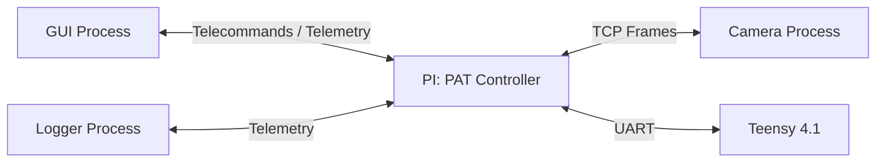

---

# 2. Runtime Architecture

## 2.1 Processes

### Diagram – System Processes

```mermaid
flowchart TB
    subgraph RP[Raspberry Pi]
        CTRL[PAT Controller Process]
        CAM[Camera Process]
    end
    GUI[External GUI Process]
    LOG[External Logger Process]
    MCU[Teensy 4.1]

    GUI -->|Telecommands| CTRL
    CTRL -->|Telemetry| GUI
    CTRL -->|Telemetry| LOG
    CAM -->|Frames (TCP)| CTRL
    CTRL -->|UART| MCU
```

---

## 2.2 Threads inside the PAT Controller

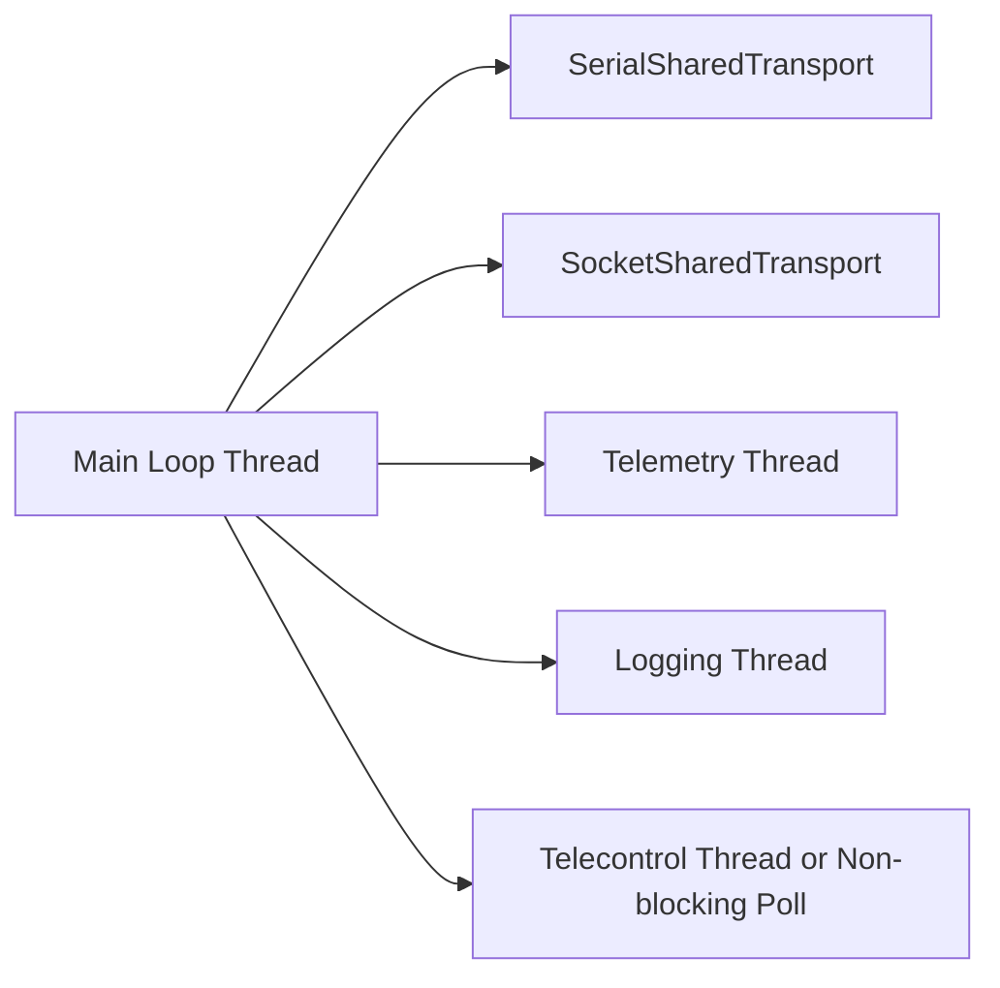

Main loop is strictly non-blocking and isolated from IO.

---

# 3. Layered Architecture

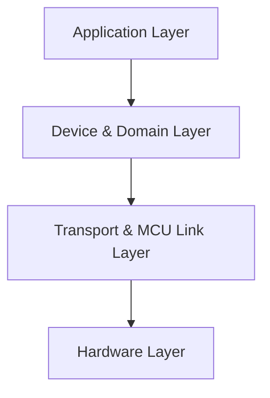

## 3.1 Application Layer

Components include:

* Controller
* StateManager and concrete states
* Sensors/Actuators/Peripherals Managers
* TelemetryManager
* TelecontrolManager
* ConfigManager

### Diagram – Application Layer Internals

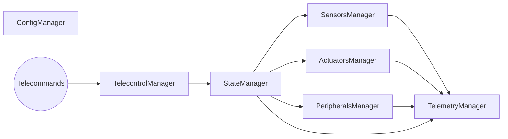

---

## 3.2 Device & Domain Layer

Logical devices with high‑level APIs, independent of hardware.

### Example Diagram

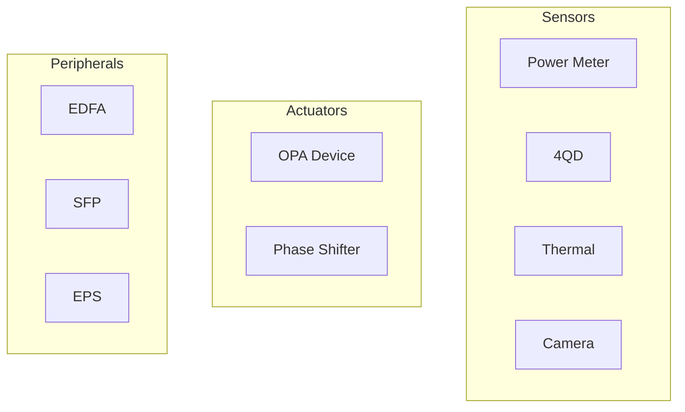

---

## 3.3 Transport & MCU Link Layer

### Diagram – Transport Model

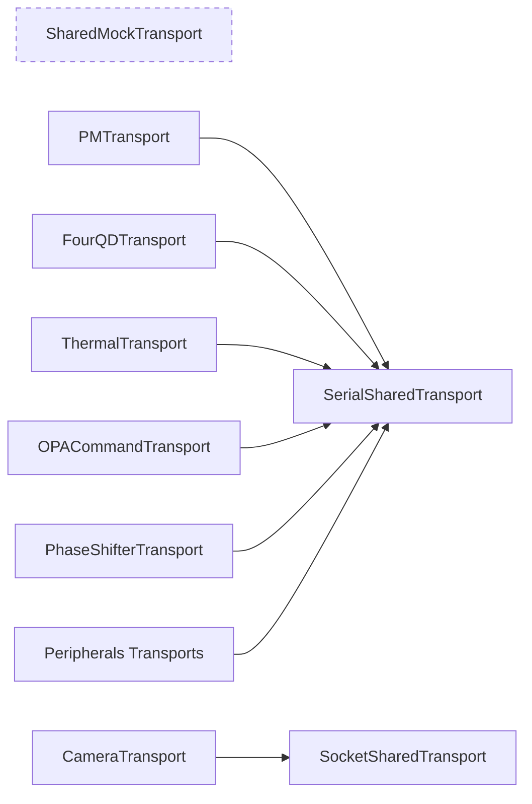

---

## 3.4 Hardware Layer

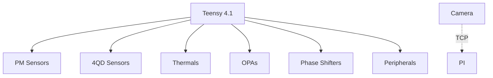

---

# 4. Teensy Firmware Architecture

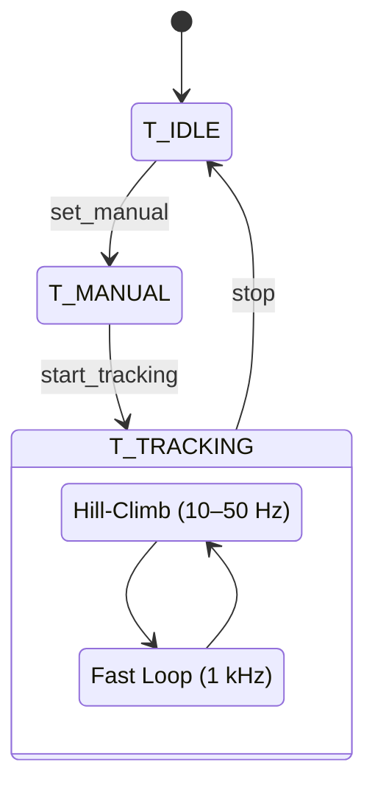

Teensy executes low‑level loops and remains autonomous on link loss.

---

# 5. Operational States (Pi Side)

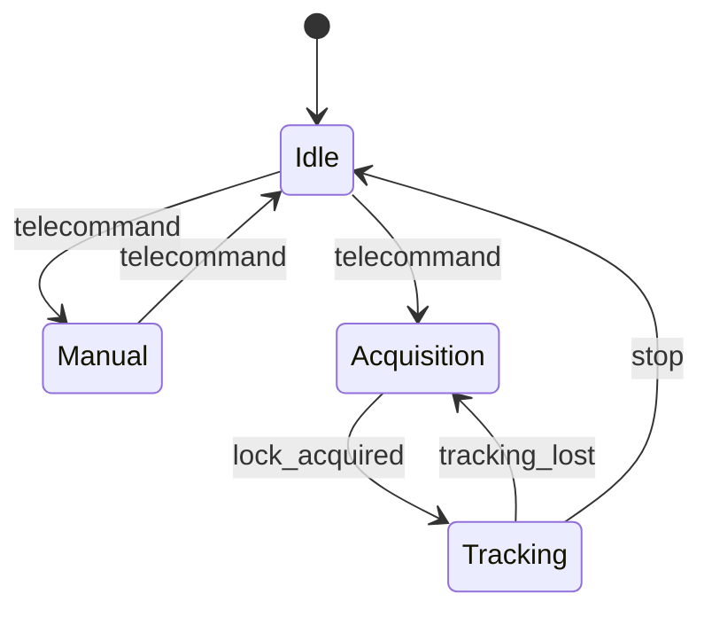

---

# 6. Control Loop Execution Model

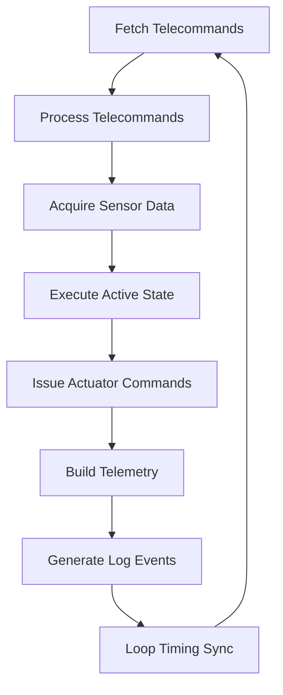

---

# 7. Telecontrol Architecture

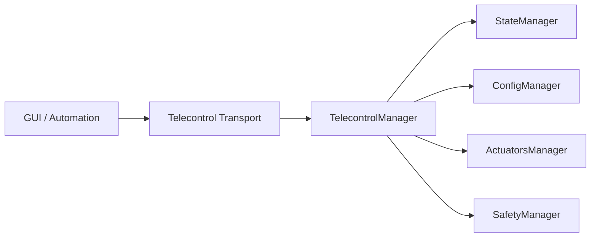

---

# 8. Telemetry & Logging Pipelines

### Telemetry

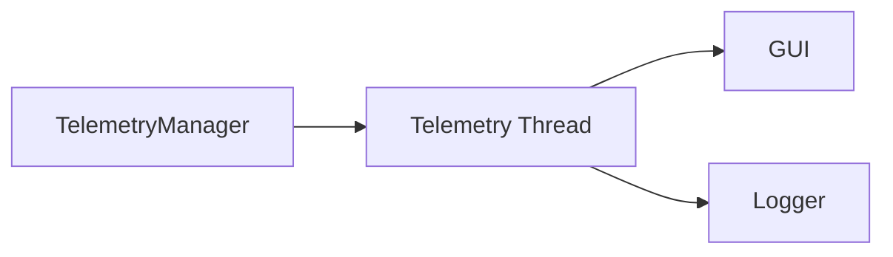

### Logging

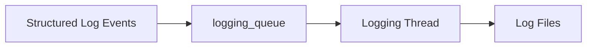

---

# 9. Migration Strategy

The architecture supports migration to a more MCU‑centric execution model without redesigning upper layers. Abstractions remain stable as Teensy responsibilities grow.

---

# 10. Summary

The PAT controller is modular, layered, soft–real-time, and future‑proof. It supports:

* Deterministic non-blocking main loop
* Multi-device, multi-transport operations
* External GUI and Logger integration
* Fully mocked environments for development
* Teensy‑accelerated execution with increasing autonomy

This README serves as the reference for developers implementing, testing, and extending the system.
