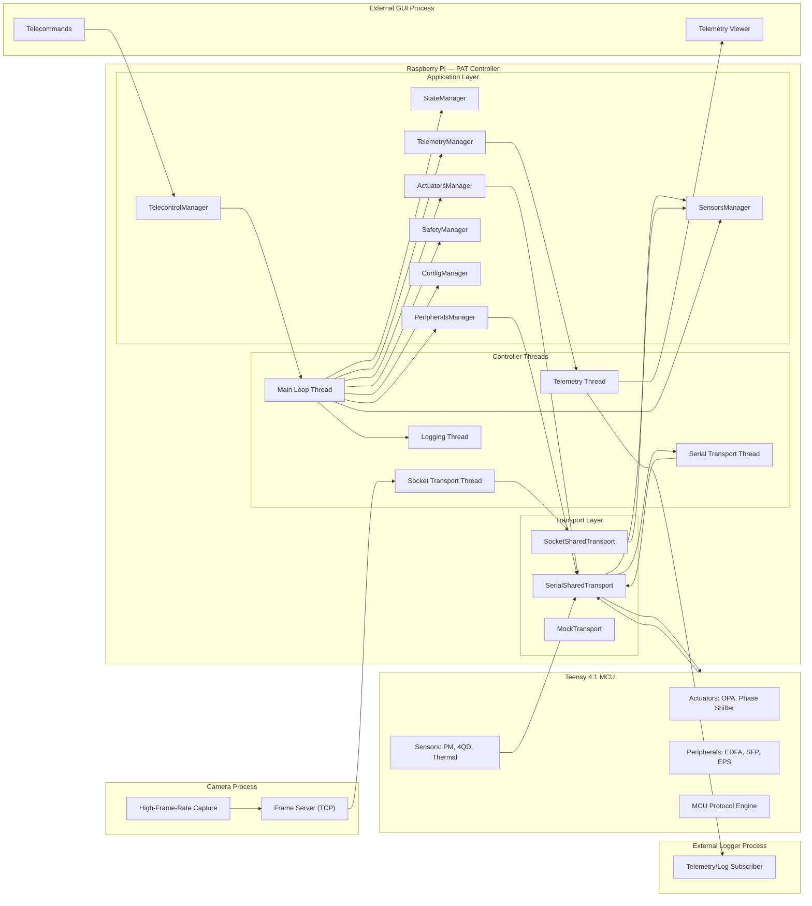
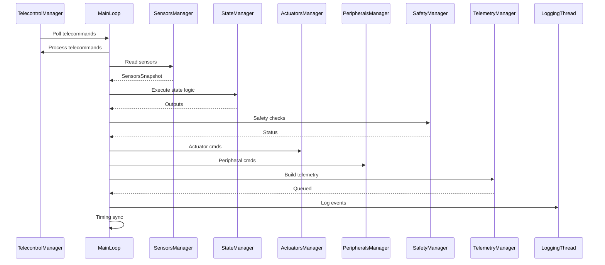
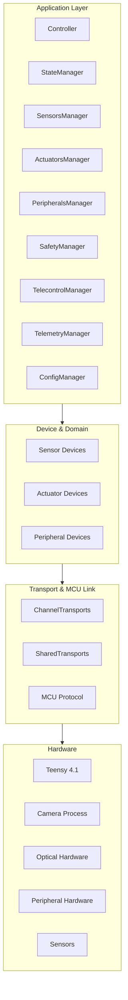
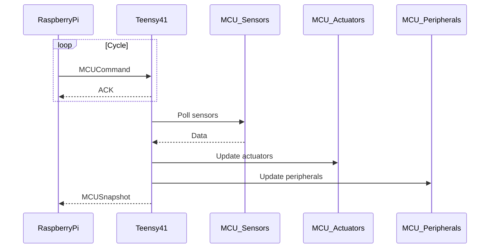
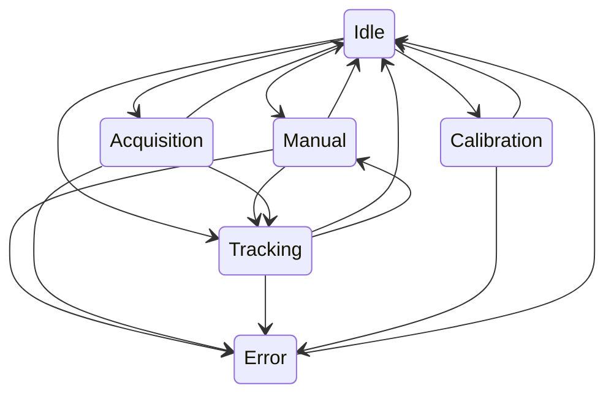
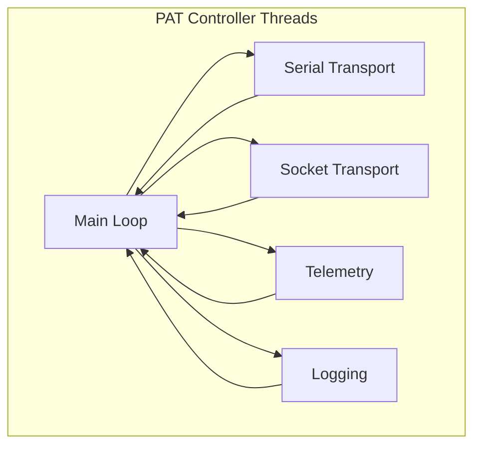

# mermaid
# PAT Controller System

## Overview
A modular soft–real-time control system for orchestrating sensors, actuators, and peripherals in an optical pointing experiment.

## High-Level System Architecture

## Control Loop Sequence

## Layered Architecture

## MCU Communication

## State Machine

## Thread Architecture

