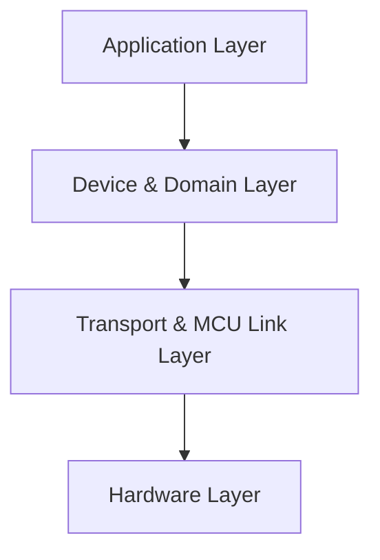
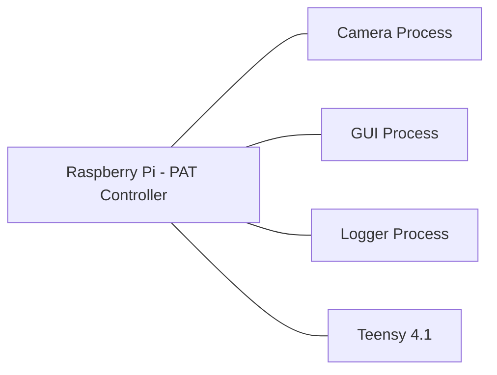
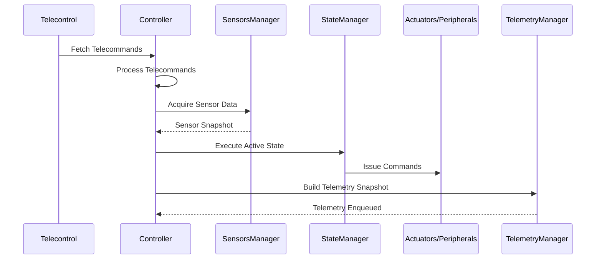

# README

```md
Project Objective
The PAT controller project aims to implement a modular, soft–real-time control system running on a Raspberry Pi, responsible for orchestrating sensors, actuators, and peripheral devices involved in an optical pointing experiment. The controller must execute deterministic state-driven logic cycles, manage telecommands, and maintain coherent telemetry, while ensuring that the same core software can operate seamlessly on real hardware or in fully mocked environments for development and validation.

## Architecture Overview (Mermaid Diagram)



## Runtime Processes (Mermaid Diagram)



## Control Loop Pipeline (Mermaid Diagram)



