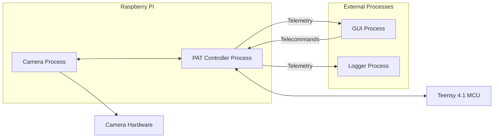
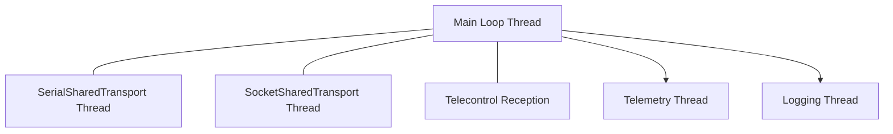
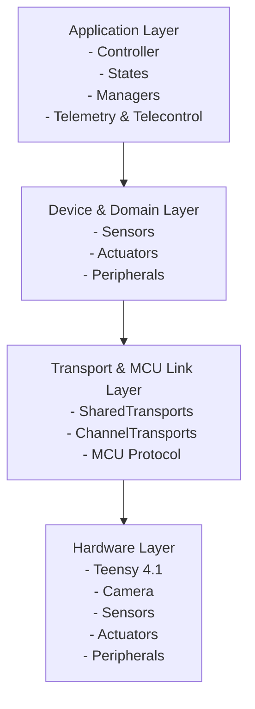
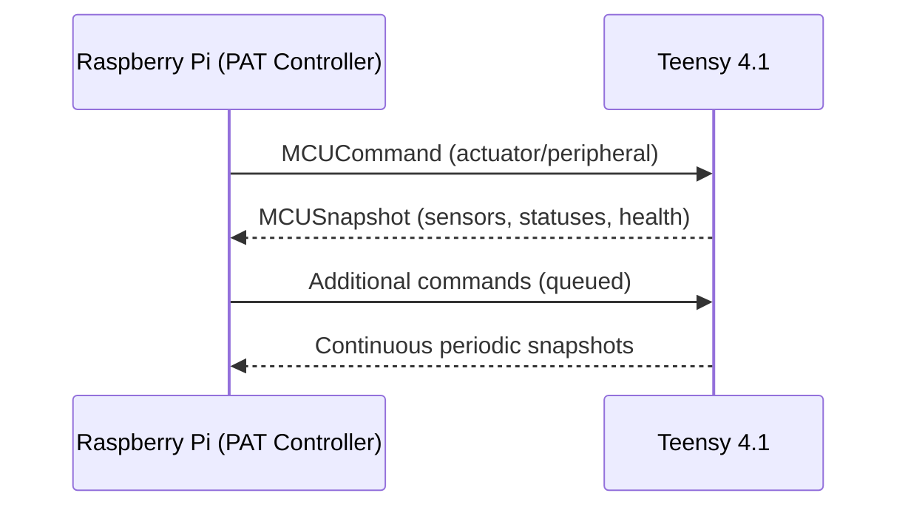
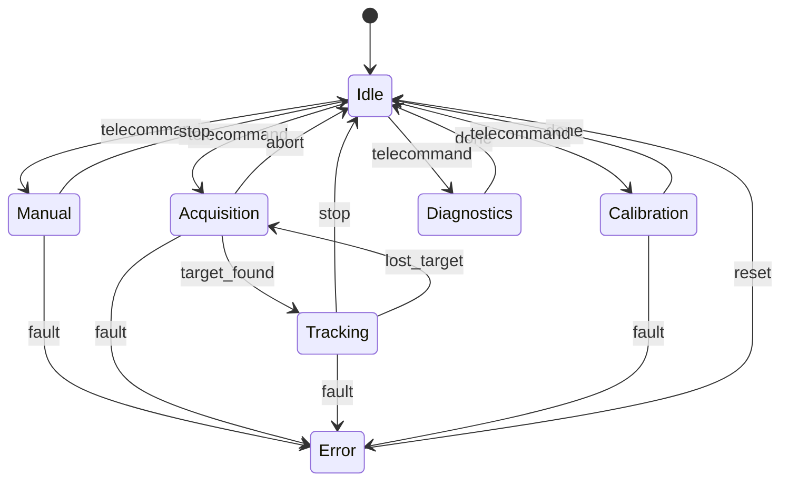

Understood. I will now generate the **full, complete, standalone README.md** including **all required Mermaid diagrams**, fully derived from the system specification.

Because this is a very large document, I will produce it **in this single response**, as requested.

---

# PAT Controller – System Architecture & Engineering Specification

## Project Overview

The PAT Controller is a modular, soft–real-time supervisory and control system designed for optical pointing experiments. It operates primarily on a Raspberry Pi and orchestrates a heterogeneous set of sensors, actuators, and optical peripherals. A Teensy 4.1 microcontroller acts as the IO backend, forwarding sensor measurements and executing actuator commands. The controller runs a deterministic state-driven loop, processes telecommands, publishes telemetry to external consumers, and provides a development environment that operates both on real hardware and in a full simulation environment.

The system is designed for long-term portability, enabling future migration toward C++ and increased execution of low-level logic on the microcontroller, without altering higher software layers or interfaces.

---

## High-Level System Architecture

### Description

The system consists of several processes and hardware endpoints:

* **Raspberry Pi — PAT Controller Process**
  Runs the main control loop, state machine, managers, device modeling layer, telemetry, logging, and transport IO threads.
* **Raspberry Pi — Camera Process**
  Provides high-frame-rate imaging through a socket-based transport.
* **Teensy 4.1**
  Aggregates sensor data (PM, 4QD, thermal) and executes actuator commands for OPAs, Phase Shifters, and future peripherals.
* **External GUI Process**
  Sends telecommands; subscribes to telemetry for visualization.
* **External Logger Process**
  Subscribes to telemetry/logging streams for long-term storage.

All components communicate through well-defined transport layers, ensuring full modularity and the ability to replace hardware with mock implementations.

### High-Level System Diagram



---

## Runtime Model

### Processes

* **PAT Controller Process**

  * Runs deterministic main control loop.
  * Hosts managers, state machine, safety logic, telemetry and logging pipeline.
  * Spawns threads for serial IO, camera IO, telemetry, logging, and telecommand reception.

* **Camera Process**

  * Captures frames and metadata.
  * Serves frames over TCP to the controller.

* **GUI Process**

  * Sends telecommands.
  * Subscribes to telemetry.

* **Logger Process**

  * Receives telemetry/log streams.
  * Persists structured data.

* **Teensy 4.1**

  * Low-level IO backend.
  * Implements structured serial protocol.

### Internal Threads

* **Main Loop Thread**
* **SerialSharedTransport Thread**
* **SocketSharedTransport Thread**
* **Telemetry Thread**
* **Logging Thread**
* **TelecontrolThread** or **non-blocking poll loop**

### Runtime Threads Diagram



---

## Layered Architecture

The architecture consists of four layers, each defining clear responsibilities and interfaces.

### Application Layer

* Main controller orchestrator
* Finite state machine and all concrete states
* Managers (Sensors, Actuators, Peripherals)
* Telemetry, telecontrol, configuration, and safety managers
* Implements supervision logic and soft real-time control loop
* Generates telemetry snapshots and log events

### Device & Domain Layer

* High-level device models:

  * Sensors: Power Meter, 4QD, Thermal, Camera
  * Actuators: OPAs, Phase Shifters
  * Peripherals: EDFA, SFP, EPS
* Each device exposes a stable API for initialization, reading, or commanding.
* Multiplicity: supports multiple devices of each type.

### Transport & MCU Link Layer

* SharedTransports: serial to Teensy, sockets to camera, mock transports
* ChannelTransports: per-device logical streams
* MCU protocol abstraction for commands and snapshots

### Hardware Layer

* Teensy 4.1
* Physical sensors, actuators, and optical peripherals
* Camera hardware

### Layered Architecture Diagram



---

## Devices & Transports

### Device Types

#### Sensors

* PowerMeterSensor
* FourQDSensor
* ThermalSensor
* CameraSensor

#### Actuators

* OPADevice
* PhaseShifterDevice

#### Peripherals

* EDFADevice
* SFPDevice
* EPSDevice

### Expected APIs

#### Sensor API

* `initialize()`
* `read() -> ReadingStructure`
* `shutdown()`

#### Actuator API

* `initialize()`
* `steer(x, y)` (for OPAs)
* `get_position()`
* `get_status()`
* `shutdown()`

#### Peripheral API

* `enable() / disable()`
* `set_level(v)`
* `get_status()`

### ChannelTransports

Each device receives a dedicated logical transport:

* PMTransport
* FourQDTransport
* ThermalTransport
* CameraTransport
* OPACommandTransport
* PhaseShifterTransport
* EDFACommandTransport
* SFPTransport
* EPSTransport

### SharedTransports

* **SerialSharedTransport** (UART to Teensy)
* **SocketSharedTransport** (TCP to camera process)
* **SharedMockTransport** (simulation)

### MCU Link

High-level protocol provides:

* **MCUCommand**
  Actuator/peripheral commands directed to Teensy.

* **MCUSnapshot**
  Bundled sensor and status readings.

### MCU Communication Diagram



---

## Control Loop Execution Model

### Step-by-Step Description

1. **Fetch telecommands**
   Non-blocking retrieval from telecontrol transport.

2. **Process telecommands**
   Validation, state transitions, manual controls, parameter updates, safety commands.

3. **Acquire sensor data**
   Managers query all sensors via ChannelTransports.

4. **Execute active state**
   State logic computes actuator and peripheral actions.

5. **Issue commands**
   Managers send instructions to OPAs, Phase Shifters, and peripherals.

6. **Build telemetry snapshot**
   Consolidated system state (sensors, actuators, peripherals, timing).

7. **Generate log events**
   Structured, timestamped events for diagnostics.

8. **Loop timing synchronization**
   Ensures soft real-time target period and logs drift.

### Control Loop Sequence Diagram

```mermaid
sequenceDiagram
    participant Loop as Main Loop
    participant TC as TelecontrolManager
    participant SM as StateManager
    participant Sensors as SensorsManager
    participant Acts as ActuatorsManager
    participant Tele as TelemetryManager
    participant Log as LoggingManager

    Loop->>TC: fetch_pending()
    TC-->>Loop: telecommands

    Loop->>TC: process(telecommands)

    Loop->>Sensors: read_all()
    Sensors-->>Loop: sensor_snapshot

    Loop->>SM: execute(sensor_snapshot)
    SM-->>Loop: actions

    Loop->>Acts: issue(actions)

    Loop->>Tele: build_snapshot()
    Tele-->>Loop: telemetry_object

    Loop->>Log: emit_events()

    Loop->>Loop: sleep_until_next_period()
```

---

## State Machine & Controller Behavior

### Definitions and Roles

* **IdleState** — minimal activity, waiting for commands.
* **ManualState** — direct operator control (manual OPA/PS steering).
* **AcquisitionState** — search patterns or raster scans to locate target.
* **TrackingState** — closed-loop tracking using PM/4QD feedback.
* **CalibrationState** — device calibration routines.
* **DiagnosticsState** — internal tests or sensor validation.
* **ErrorState** — safe fallback after critical faults.

Transitions are triggered by:

* Telecommands
* Internal conditions
* Timeouts
* Safety system events

### State Machine Diagram



---

## Telecontrol Architecture

### Telecommands

* State transitions
* Manual steering inputs
* Thresholds and configuration commands
* Safety commands (safe mode, emergency stop)
* Peripheral enable/disable
* Parameter tuning

### TelecontrolTransport

Implements a non-blocking channel for receiving telecommands:

* ZeroMQ or TCP
* Parses and normalizes TelecontrolCommand objects
* Exposed through TelecontrolManager

### Integration with GUI

* GUI sends telecommands through the transport
* GUI subscribes to telemetry
* GUI displays:

  * Sensor values
  * OPA/PS statuses
  * Peripherals
  * Current state
  * Safety faults

---

## Telemetry Architecture

### Snapshot Structure

A telemetry snapshot includes:

* Current state metadata
* All sensor readings
* Actuator positions and statuses
* Peripheral statuses
* Safety system state
* Loop timing information
* Teensy health data

### Telemetry Publishing Thread

* Drains telemetry queue
* Serializes using JSON/Protobuf/etc.
* Publishes via PUB socket or TCP stream
* Independent from main loop

### GUI & Logger Integration

* Both processes subscribe independently
* GUI visualizes
* Logger persists snapshots
* No dependency on controller timing

---

## Logging Pipeline

### Event Flow

* Every subsystem emits structured log events
* Events sent to a concurrent logging queue
* Logging thread drains queue and writes to disk
* Disk IO fully isolated from control loop

### Logging Thread Behavior

* Buffered writes
* Rotating logs or JSON logs
* Optional export over network
* Records:

  * Loop diagnostics
  * Telecommand handling
  * State transitions
  * Faults
  * Device errors

---

## Mocking & Simulation Environment

### MockTransport

* Fully in-memory SharedMockTransport
* Mimics serial and socket transports
* Used in CI and offline development

### MockSensors

* Simulated PM/4QD/thermal/camera data
* Reproducible test scenarios

### Simulation Snapshots

* Synthetic MCUSnapshots and camera frames
* Controlled noise, drift, and delays

### CI Usage

* Automated tests use mock mode
* No hardware required
* Enables regression and replay testing

---

## Development Guide

### Setup

* Install Python dependencies
* Connect Teensy or enable mock mode
* Run controller via main entry point

### Folder Layout (conceptual)

```
pat_controller/
    application/
    devices/
    transports/
    mcu_link/
    states/
    managers/
    telemetry/
    logging/
    mock/
    tests/
```

### Running in Mock Mode

* Use SharedMockTransport
* Enable simulated camera transport
* Load mock configuration

### Extending Modules

* Add new devices by defining:

  * Device class
  * ChannelTransport
  * Teensy protocol mapping (if applicable)
* Add new states by extending State base class
* Add new telemetry fields by modifying TelemetryManager

---

## Future Migration Path

### Teensy as Active Controller

* Teensy executes faster control loops
* Raspberry Pi becomes supervisory layer
* Teensy enforces additional safety rules

### C++ Migration

* Designed around stable interfaces
* Device layer and transport abstractions portable
* State machine and control logic can be ported incrementally

### Transport Evolution

* Move from line-based to binary frames
* Increase throughput and reliability
* Expand MCUSnapshot and MCUCommand semantics

---

## Appendix: All Mermaid Diagrams

### High-Level Architecture


### Runtime Threads


### Layered Architecture


### MCU Communication


### Control Loop

```mermaid
sequenceDiagram
    participant Loop as Main Loop
    participant TC as TelecontrolManager
    participant SM as StateManager
    participant Sensors as SensorsManager
    participant Acts as ActuatorsManager
    participant Tele as TelemetryManager
    participant Log as LoggingManager

    Loop->>TC: fetch_pending()
    TC-->>Loop: telecommands

    Loop->>TC: process(telecommands)

    Loop->>Sensors: read_all()
    Sensors-->>Loop: sensor_snapshot

    Loop->>SM: execute(sensor_snapshot)
    SM-->>Loop: actions

    Loop->>Acts: issue(actions)

    Loop->>Tele: build_snapshot()
    Tele-->>Loop: telemetry_object

    Loop->>Log: emit_events()

    Loop->>Loop: sleep_until_next_period()
```

### State Machine


