# PAT Controller System

This README provides a complete architectural overview of the **PAT Controller**, including runtime model, abstraction layers, processes, state machines, telemetry/telecontrol paths, and future migration strategy. It also includes **Mermaid diagrams** rendered natively by GitHub.

---

## 1. High-Level System Overview

The PAT Controller is a modular soft–real‑time supervision and control system running on a Raspberry Pi. A Teensy 4.1 microcontroller provides low‑level IO, sensor aggregation, and actuator control. External processes such as the GUI and Logger interact via network transports.

### High-Level Architecture Diagram

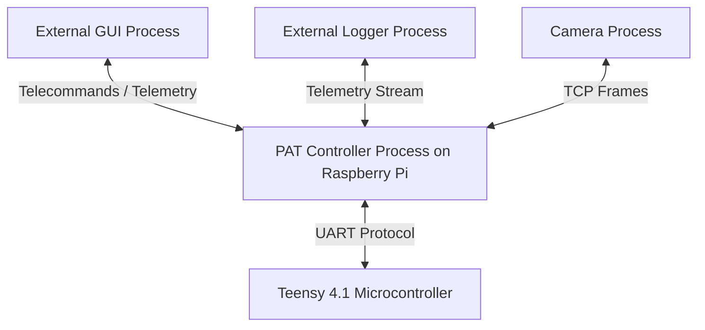

---

## 2. Layered Architecture

The system is structured into four main layers.

### Layer Diagram

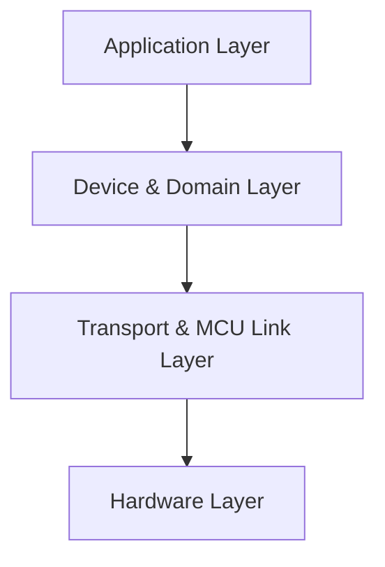

---

## 3. Application Layer

Contains the main logic, managers, states, telemetry, telecontrol, configuration and safety.

### Application Layer Diagram

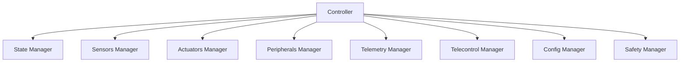

---

## 4. Device & Domain Layer

This layer models every sensor, actuator, and peripheral using stable, high-level interfaces. All hardware interactions go through channel transports.

### Device Layer Diagram

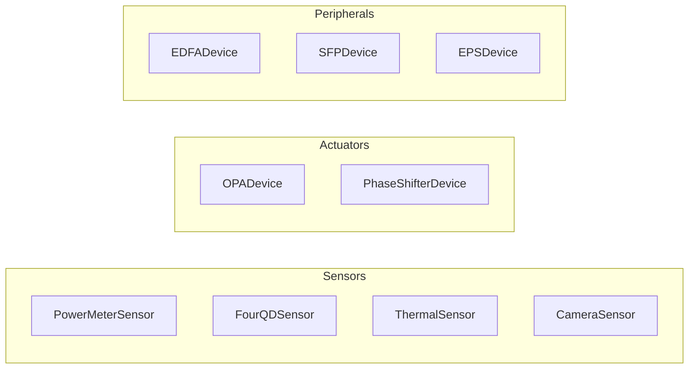

---

## 5. Transport & MCU Link Layer

This layer abstracts physical IO and routing of messages.

### Transports Diagram

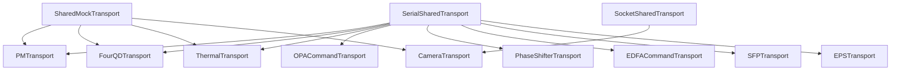

---

## 6. Hardware Layer

Represents physical devices: Teensy, sensors, actuators, and peripherals.

### Hardware Diagram

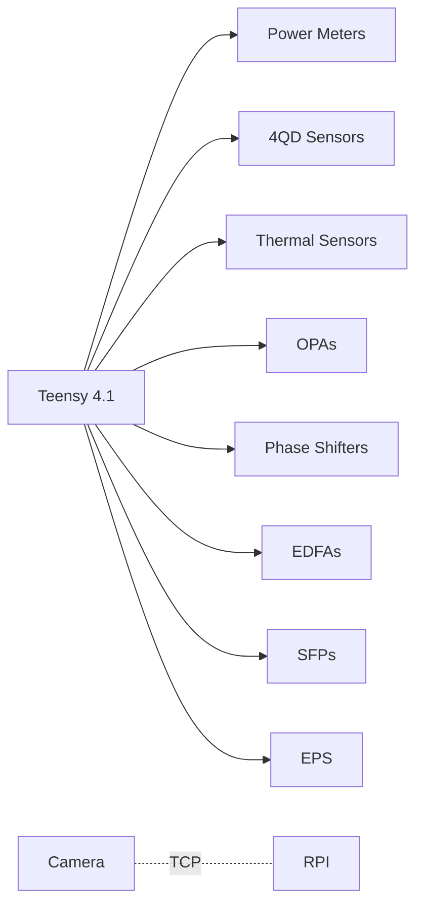

---

## 7. Runtime Model (Processes & Threads)

The PAT Controller separates deterministic logic from blocking IO.

### Processes Diagram

```mermaid
flowchart TD
    PAT[pat_controller Process (Raspberry Pi)]
    CAM[Camera Process]
    GUI[GUI Process]
    LOGP[Logger Process]
    MCU[Teensy 4.1]

    GUI <--> PAT
    LOGP <--> PAT
    CAM <--> PAT
    PAT <--> MCU
```

### Internal Threads

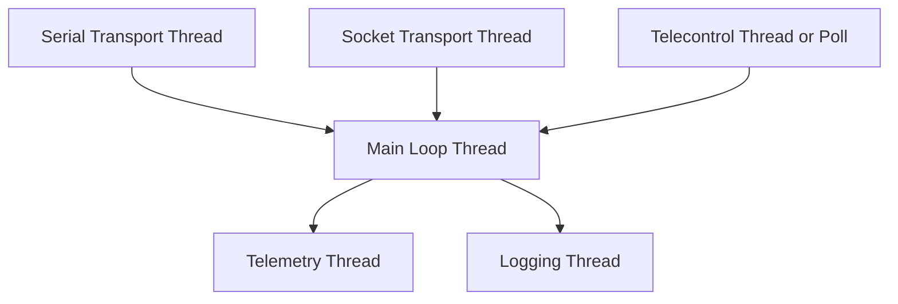

---

## 8. Teensy Firmware Architecture

The Teensy executes fast micro-loops and provides structured snapshots.

### Teensy Diagram

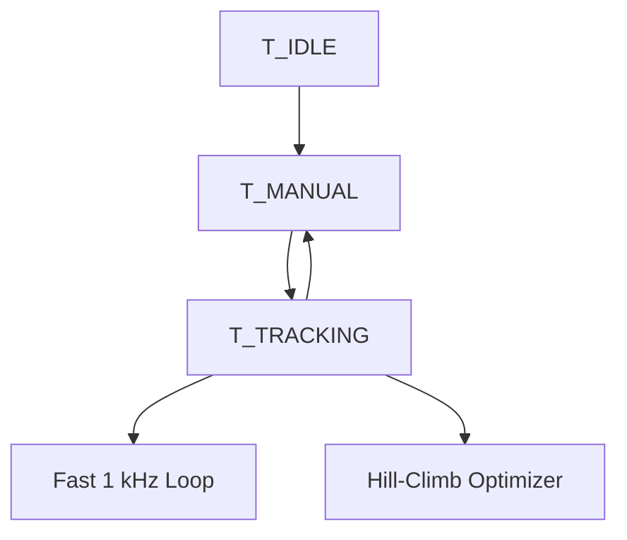

---

## 9. Operational States

### State Machine Diagram

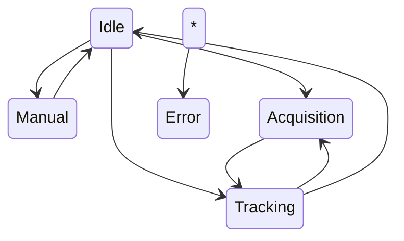

---

## 10. Main Control Loop

### Control Loop Diagram

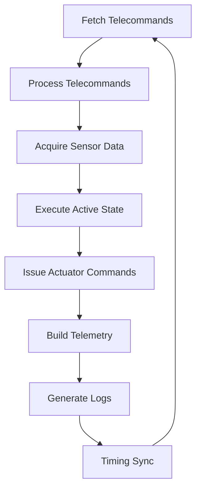

---

## 11. Telecontrol Architecture

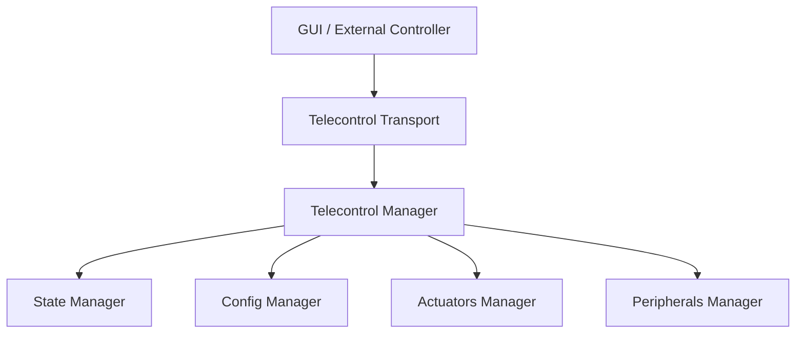

---

## 12. Telemetry & External Integration

### Telemetry Pipeline

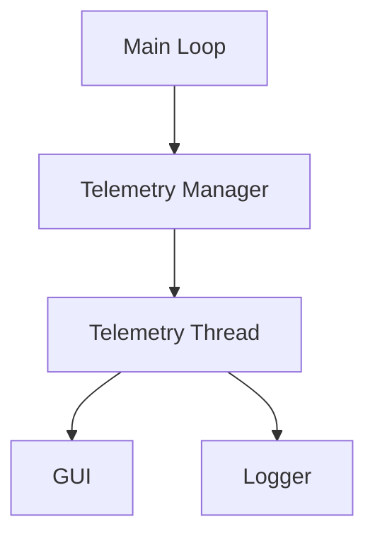

---

## 13. Logging Pipeline

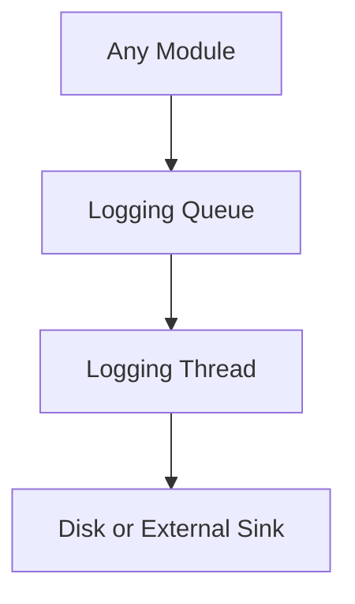

---

## 14. Migration Path

The design is compatible with future C++ Teensy logic and richer MCU protocols.

---

## 15. Summary

This README provides:

* A full architectural description
* Layer diagrams
* Runtime/process diagrams
* Firmware state diagrams
* Control loop flow
* Telemetry/telecontrol pipelines

The system is modular, testable, and future‑proof.

