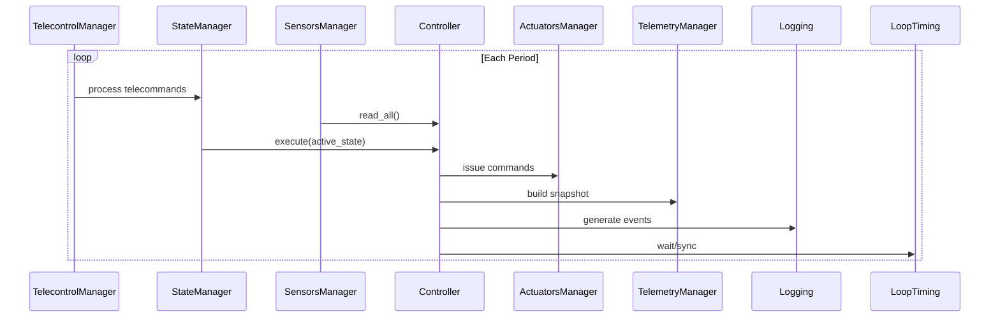
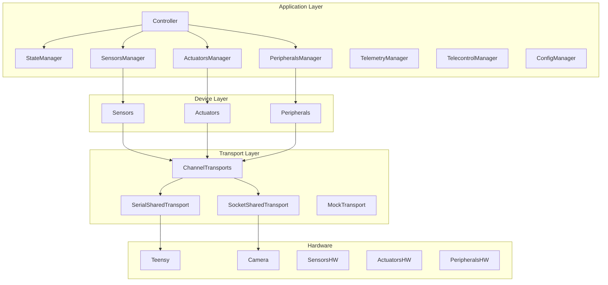

````markdown
# PAT Controller — Developer Architecture & Implementation Guide

## 1. Introduction

The PAT Controller is a modular, soft–real-time supervision and control system designed to orchestrate optical sensors, actuators, and peripheral devices involved in pointing, acquisition, and tracking experiments.  
It runs primarily on a **Raspberry Pi**, coordinates a **Teensy 4.1** for low-level IO, and communicates with external **GUI** and **Logger** processes.

The software is fully mockable and buildable without hardware, enabling algorithm development, CI validation, and replay-based testing on any machine.

This document summarizes the complete architecture, runtime model, components, interfaces, and development guidelines for engineers implementing or extending the system.

---

## 2. System Overview

### 2.1 Goals

- Execute deterministic, state-driven control loops.
- Manage sensors, actuators, and optical peripherals.
- Support telecommands from a GUI or automated tools.
- Publish rich telemetry for real-time monitoring and logging.
- Remain fully functional in **real hardware** or **simulation-only** mode.
- Allow future migration of fast control logic to **Teensy C++ firmware**.

### 2.2 Deployment Summary

| Component | Platform | Role |
|----------|----------|------|
| PAT Controller | Raspberry Pi | Main control loop, state machine, telecommands, telemetry |
| Camera Process | Raspberry Pi | High-rate imaging through TCP |
| Teensy 4.1 | MCU | Fast sensor acquisition, actuator control |
| GUI | External | Telecommands + telemetry display |
| Logger | External | Persistent telemetry storage |

---

## 3. Runtime Architecture

### 3.1 Process Model

```mermaid
flowchart LR
    GUI -->|Telecommands| PAT
    PAT -->|Telemetry| GUI
    PAT -->|Telemetry| LOGGER
    PAT <-->|UART| TEENSY
    CAMERA <-->|TCP| PAT
````

* **PAT Controller (main process)**
  Runs the control loop, state machine, device managers, and transport interfaces.

* **Camera Process**
  Streams frames via TCP.

* **Teensy Firmware**
  Performs low-level control logic and publishes structured snapshots.

* **GUI / Logger**
  External telemetry consumers + telecommand sources.

---

### 3.2 Threads in the PAT Controller

| Thread                    | Responsibility                                     |
| ------------------------- | -------------------------------------------------- |
| **Main Loop Thread**      | Deterministic supervision loop; never blocks on IO |
| **SerialSharedTransport** | UART communication with Teensy                     |
| **SocketSharedTransport** | TCP communication with camera device               |
| **Telemetry Thread**      | Serializes and publishes telemetry                 |
| **Logging Thread**        | Asynchronous log writing                           |
| **Telecontrol Mechanism** | Dedicated thread **or** non-blocking poll          |

This guarantees hardware IO, logging, and telecommands never interrupt the soft real-time loop.

---

## 4. Layered Architecture

```mermaid
flowchart TD
    A[Application Layer] --> D[Device & Domain Layer]
    D --> T[Transport & MCU Link Layer]
    T --> H[Hardware Layer]
```

### 4.1 Application Layer

High-level control logic:

* Controller
* StateManager + States (Idle, Manual, Acquisition, Tracking, Error)
* SensorsManager
* ActuatorsManager
* PeripheralsManager
* TelemetryManager
* TelecontrolManager
* ConfigManager
* SafetyManager

Responsibilities include orchestrating loop execution, state transitions, safety, telecommands, telemetry, and log generation.

---

### 4.2 Device & Domain Layer

Provides stable abstractions for all hardware devices:

#### Sensors

* PowerMeterSensor
* FourQDSensor
* ThermalSensor
* CameraSensor

#### Actuators

* OPADevice
* PhaseShifterDevice

#### Peripherals

* EDFADevice
* SFPDevice
* EPSDevice

Each device supports:

```text
initialize()
read() / get_status()
send_command(...)
shutdown()
```

Device code **never touches hardware directly**—only through ChannelTransports.

---

### 4.3 Transport & MCU Link Layer

#### Shared Transports

* **SerialSharedTransport (UART to Teensy)**
* **SocketSharedTransport (TCP camera)**
* **SharedMockTransport (simulation mode)**

#### Channel Transports

Dedicated logical channels per device type:

```text
PMTransport
FourQDTransport
ThermalTransport
CameraTransport
OPACommandTransport
PhaseShifterTransport
EDFACommandTransport
SFPTransport
EPSTransport
```

All provide:

* `receive(timeout)`
* `send_command(...)`

#### MCU Link

Defines:

* **MCUCommand** – high-level actuator/peripheral commands
* **MCUSnapshot** – full structured telemetry from Teensy

---

### 4.4 Hardware Layer

Actual physical components:

* Teensy 4.1 (UART link)
* Sensors: PM, 4QD, thermal
* Actuators: OPAs, Phase Shifters
* Peripherals: EDFA, SFP, EPS
* High-rate camera (TCP)

---

## 5. Teensy Firmware Architecture

### 5.1 Teensy States

* `T_IDLE`
* `T_MANUAL`
* `T_TRACKING`

### 5.2 Fast Control Loop (1 kHz)

* Reads 4QD
* Commands OPA
* Enforces hardware limits

### 5.3 Hill-Climb Loop (10–50 Hz)

* Perturbations + optimization
* Adjusts bias offsets

### 5.4 Host Link

* Snapshot transmission
* Mode changes
* Heartbeats

Teensy remains autonomous if the Raspberry Pi falters.

---

## 6. Operational States (RASPBERRY PI)

### **Idle**

System powered but inert; used for configuration.

### **Manual**

Operator directly steers actuators.

### **Acquisition**

Executes scanning routines and coarse target detection.

### **Tracking**

Supervisory layer over Teensy’s internal tracking logic.

---

## 7. Control Loop Execution Model



Steps:

1. Fetch telecommands
2. Process telecommands
3. Read sensors
4. Execute active state
5. Dispatch actuator/peripheral commands
6. Build telemetry
7. Log events
8. Loop timing synchronization

Soft real-time with bounded jitter.

---

## 8. Telecontrol Architecture

### 8.1 Telecontrol Sources

* GUI
* Automated scripts/tools

### 8.2 Telecontrol Transport

Can be:

* ZeroMQ
* TCP
* Any message-bus abstraction

Must support **non-blocking reads**.

### 8.3 Telecontrol Manager

* Retrieves + validates telecommands
* Routes them to the appropriate manager
* Emits log events
* May send acknowledgements

---

## 9. Telemetry Architecture

### Telemetry Thread

* Drains telemetry queue
* Serializes (JSON/Protobuf)
* Publishes through ZeroMQ/TCP

### GUI

* Subscribes to telemetry
* Presents state, sensors, actuators, alarms
* Sends telecommands

### Logger

* Subscribes to telemetry/logs
* Persists telemetry
* Enables replay, analysis, CI validation

---

## 10. Logging Pipeline

* All modules emit structured events.
* Logging Thread handles disk IO asynchronously.
* Logs may also be exported over network to the Logger process.

Ensures the main loop never blocks on log writing.

---

## 11. Mocking & Simulation Strategy

Using `SharedMockTransport`, the system can run fully without hardware:

* Simulated latency
* Synthetic sensor signals
* Fault injection
* Deterministic testing
* CI-friendly replay tools

This enables a fully offline development workflow.

---

## 12. Migration Path Toward Architecture C (Teensy-Centric Control)

The design supports future migration where:

* Teensy hosts fast micro-loops and safety logic.
* MCU protocol becomes richer (binary frames).
* Raspberry Pi stays as the supervisory controller.

Thanks to stable abstractions (devices, transports, state machine), upper layers require **no redesign**.

---

## 13. Development Guidelines

### 13.1 Code Organization Recommendations

```
pat_controller/
    application/
    devices/
    transports/
    mcu_link/
    states/
    managers/
    telemetry/
    telecontrol/
    logging/
    utils/
```

### 13.2 Best Practices

* Keep the main loop strictly non-blocking.
* Push IO to background threads.
* Maintain deterministic loop timing.
* Use channel transports exclusively—never access shared transports directly.
* Preserve clear separation between application logic and hardware semantics.
* Maintain strict typing for snapshots and readings.

---

## 14. Mermaid Architecture Diagrams

### 14.1 High-Level Structural Diagram



---

## 15. Summary

The PAT Controller architecture is:

* **Layered & modular**, enabling clean separation of concerns.
* **Soft–real-time**, with control-loop determinism preserved through thread isolation.
* **Extensible**, supporting multiple sensors, actuators, and peripherals.
* **Telecommand-driven**, integrating GUI and automated clients.
* **Telemetry-centric**, enabling monitoring, logging, replay, and CI workflows.
* **Hardware-agnostic**, fully operational through mock transports.
* **Future-proof**, enabling C++ migration with minimal impact on upper layers.

This README serves as the reference for developers implementing, maintaining, or extending the system.

---

```
```
