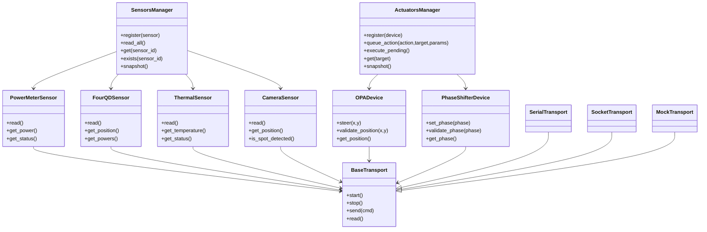

# PAT Controller — Layered Architecture
---

# 1. Overview

The PAT controller project aims to implement a modular, soft–real-time control system running on a Raspberry Pi, responsible for orchestrating sensors, actuators, and peripheral devices involved in an optical pointing experiment. The controller must execute deterministic state-driven logic cycles, manage telecommands, and maintain coherent telemetry, while ensuring that the same core software can operate seamlessly on real hardware or in fully mocked environments for development and validation.

## 1.1 System Scope & Deployment Model
The system runs primarily on a Raspberry Pi, which executes the main control loop and manages all high-level logic. A Teensy 4.1 microcontroller acts as the low-level actuation and sensing backend, generating signals for optical actuators (OPAs and Phase Shifters) and aggregating several sensor measurements (Power Meters, 4QD, thermal sensors, etc.). Some sensors—most notably the high-frame-rate camera—may execute in a separate process on the Raspberry Pi, communicating with the controller through an inter-process or socket-based transport.
The architecture must remain highly modular, allowing devices, transports, and state machines to be replaced or extended without impacting the overall system. Every component should be abstracted behind well-defined interfaces, enabling both real-hardware operation and simulation-only development.

## 1.2 Operational Purpose
The controller must support a family of state-based algorithms related to optical pointing, including:
•	manual control,
•	target acquisition,
•	closed-loop tracking,
•	scanning patterns,
•	and experiment-specific routines.
State logic determines how sensor data is interpreted, how actuators are commanded, and how transitions between operational modes occur. Telecommands may reconfigure thresholds, setpoints, states, or safety conditions in real time.

## 1.3 Timing Characteristics
The system targets soft real-time performance:
•	Each supervision cycle should maintain a consistent loop period with bounded jitter.
•	Occasional delays are acceptable as long as the system remains coherent and responsive.
•	Timing diagnostics must be recorded to monitor drift and overload conditions.

No hard real-time guarantees are required, but the architecture must allow future migration toward tighter timing constraints or a partial rewrite in C++.

## 1.4 Long-Term Portability
Although initially implemented in Python, the project must be designed so its logic, interfaces, and abstractions can be migrated to C++ without architectural redesign. The long-term target may include running more logic directly on the Teensy or replacing transports with tighter embedded integrations.

## 1.5 Layered Architecture
- Application Layer  
- Device Layer  
- Transport Layer  
- Hardware Layer  

---

# 2. Application Layer

The Application Layer is responsible for coordinating all high-level logic of the PAT control system running on the Raspberry Pi. Its main role is to **orchestrate the supervision cycle**, manage state transitions, process telecommands, build telemetry, and issue validated actuator commands. It acts as the central logic hub, while remaining independent from hardware details and low-level protocol operations.

---

## Main Components

| Component | Purpose |
|-----------|---------|
| **ConfigManager** | Loads configuration, initializes all services, and configures the Teensy. |
| **Controller** | Executes the supervised control cycle. |
| **StateManager** | Coordinates the main FSM and executes state logic. |
| **SensorsManager** | Handles collection, caching, and safe access to sensor values. |
| **ActuatorsManager** | Validates and executes actuator commands requested by states or telecontrol. |
| **TelemetryManager** | Builds and publishes consistent telemetry at each loop iteration. |
| **TelecontrolManager** | Receives, parses, and dispatches external commands (state change, actuator requests, runtime configuration, etc.). |

---

## ConfigManager

### Responsibilities

The `ConfigManager` acts as the **single entry point** to the Application Layer. It is responsible for:

### Main Functions
- **Reading required configuration from a `.json` file.**
- **Sending initialization and calibration commands to the Teensy**, using the setup protocol (`setup init`, `setup ...`, `setup finish`).
- **Building and initializing the `Controller`**, creating:
  - managers
  - transports
  - sensors
  - actuators

> No control logic can start without the ConfigManager. It owns system bootstrap.

---

## Initialization Workflow

The `ConfigManager` follows this sequence:

```

1. Load the configuration from a .json file
2. Instantiate all configured transports
3. Create and register all sensor and actuator devices
4. Send configuration commands to the Teensy
5. Build and initialize the Controller and all managers
6. Return a ready Controller instance

```

---

## Controller

The `Controller` coordinates the supervised control cycle. Each iteration performs:

```

1. Telecontrol acquisition
2. Telecontrol validation and dispatch
3. Sensor readout (non-blocking)
4. Execution of the active state logic
5. Validation and application of actuator commands
6. Telemetry construction
7. Telemetry publication
8. Optional logging and diagnostics
9. Loop timing synchronization

```

The Controller does **not** deal directly with hardware transports or devices.  
It merely orchestrates decoupled managers.

---

## Finite State Machine

The `StateManager` maintains the system state (Idle, Manual, Acquisition, Tracking, Error).  
Each state implements:

- `on_enter()` and `on_exit()` lifecycle logic
- cyclic `step()` logic executed at each loop iteration
- safe interaction with system resources via `request_action()`

States **never talk to actuators directly**. Instead, they **request commands**, and the `ActuatorsManager` validates and executes them.

---

## Telecontrol Integration

Incoming telecommands may:

- Switch system state
- Modify runtime configuration
- Request direct actuator actions (only when allowed, e.g. Manual mode)
- Trigger procedures or experiment routines

The `TelecontrolManager` only **parses and validates incoming messages**.  
Actual execution always happens through specialized managers.

---

## Execution

Once the `Controller` is created by the `ConfigManager`, the system starts with:

```python
controller.start()
```

This boots:

* transport threads
* managers
* state machine
* supervised control loop

## TelemetryManager

### Responsibilities

The `TelemetryManager` produces coherent telemetry snapshots that represent the full system view at a given loop iteration. Telemetry must reflect:

- recent sensor measurements
- current actuator commanded values
- current system and state names
- runtime configuration overrides
- diagnostics (timing, errors, link statuses)

### Key Functions
| Method | Description |
|--------|-------------|
| `build_snapshot()` | Creates a unified telemetry structure. |
| `send(snapshot)` | Publishes telemetry through its configured transport. |
| `log(snapshot)` | Optionally logs data locally. |

### Telemetry Contents

Typical telemetry fields:

```
{
"timestamp": ...,
"state": "Tracking",
"sensors": { ... },
"actuators": { ... },
"config_runtime": { ... },
"diagnostics": { "loop_time_ms": ..., "jitter_ms": ... }
}
```

---

##  SensorsManager

###  Responsibilities

The `SensorsManager` centralizes and abstracts sensor access. It provides:

- non-blocking reads from Transport Layer channels
- cached values for deterministic state algorithms
- typed access to specific sensor readings (power, 4QD position, temperature, camera centroid, etc.)
- validation of availability and freshness of data

###  Key Functions

| Method | Description |
|--------|-------------|
| `register(sensor)` | Registers a sensor object; enforces unique channel IDs. |
| `read_all()` | Calls `read()` on each sensor (non-blocking) and reports per-channel success. |
| `get(sensor_id)` | Returns a sensor by channel or unique device_id. |
| `exists(sensor_id)` | Fast existence check by channel or device_id. |
| `snapshot()` | Returns a telemetry-ready dictionary of cached values for known sensor types. |
| `clear()` | Resets registry/caches (testing). |

Sensors return **cached values only**, preventing I/O blocking inside the control loop.

Current implementation (Python): `application/sensors_manager.py`
- Supports PowerMeter, FourQDSensor, ThermalSensor, CameraSensor.
- Tolerates missing data and sensor-specific exceptions without breaking the loop.
- Used in unit tests with `transport.MockTransport`.

---

##  ActuatorsManager

###  Responsibilities

The `ActuatorsManager` is the **validated execution point** for actuator actions. It enforces:

- power/phase safety limits
- steering matrix logic
- unit bounds and calibration rules
- command logging and reproducibility

### Key Functions

| Method | Description |
|--------|-------------|
| `register(device)` | Registers an actuator device; enforces unique channel IDs. |
| `queue_action(action, target, **params)` | Enqueues an action (e.g., `steer`, `set_phase`) for later execution. |
| `execute_pending()` | Executes all queued actions, returning per-action result/error and clearing the queue. |
| `get(target)` | Retrieves an actuator by channel or unique device_id (raises on ambiguity). |
| `snapshot()` | Exposes cached commanded state per actuator for telemetry. |
| `pending_count()` / `clear()` | Queue/registry helpers (testing). |

> No actuator can be commanded outside the ActuatorsManager, ensuring global safety and unified logging.

Current implementation (Python): `application/actuators_manager.py`
- Supports OPADevice and PhaseShifterDevice out of the box; extensible to other actuators.
- Catches action exceptions and reports them without crashing the control loop.

---

---

# 3. Device & Domain Layer

In this architecture, a **Sensor** is a software class that represents a physical measurement device. Its main responsibility is to abstract low-level communication, providing a simple, non-blocking interface for the rest of the application to access the most recent data. Each sensor is associated with a `Transport` (such as a serial port or a socket) from which it reads raw data asynchronously. This data is processed, cached internally, and exposed through methods like `get_power()` or `get_position()`. This design decouples the main control loop from the latency of I/O operations.

## 3.1 Sensors

### PowerMeterSensor
- **Responsibility:** Wraps a power meter sensor, providing a non-blocking interface to read the latest cached power and status values from its assigned transport channel.

| Attribute | Description |
|-----------|-------------|
| `device_id` | Numeric PM ID, channel name `pm{device_id}`. |
| `transport: BaseTransport` | Telemetry link. |
| `_power` | Last cached power value in dBm. |
| `_status` | Last cached status string. |

| Method | Description |
|--------|-------------|
| `read(timeout=None) -> float` | Reads the latest data from the transport, updates internal power and status, and returns the power value. |
| `get_power() -> float` | Returns the most recent cached power reading. |
| `get_status() -> str` | Returns the most recent cached status. |
| `get_channel_id() -> str` | Returns `"pm{device_id}"`. |

### FourQDSensor
- **Responsibility:** Wraps a 4-quadrant detector (4QD) sensor, providing a non-blocking interface to read the latest cached quadrant power values (a, b, c, d) and angular position (x, y) from its assigned transport channel.

| Attribute | Description |
|-----------|-------------|
| `device_id` | Numeric 4QD ID, channel name `4qd{device_id}`. |
| `transport: BaseTransport` | Telemetry link. |
| `_a`, `_b`, `_c`, `_d` | Last cached power values in dBm. |
| `_x`, `_y` | Last cached angular position in milliradians. |

| Method | Description |
|--------|-------------|
| `read(timeout=None) -> bool` | Reads the latest data from the transport, updates internal state, and returns `True` if data was processed. |
| `get_position() -> (x, y)` | Returns the most recent cached angular position `(x, y)` in mrad. |
| `get_powers() -> (a, b, c, d)` | Returns the most recent cached quadrant powers `(a, b, c, d)` in dBm. |
| `get_channel_id() -> str` | Returns `"4qd{device_id}"`. |

### ThermalSensor
- **Responsibility:** Wraps a thermal sensor, providing a non-blocking interface to read the latest cached temperature and status values from its assigned transport channel.

| Attribute | Description |
|-----------|-------------|
| `device_id` | Numeric TH ID, channel name `th{device_id}`. |
| `transport: BaseTransport` | Telemetry link. |
| `_temperature` | Last cached temperature value. |
| `_status` | Last cached status string. |

| Method | Description |
|--------|-------------|
| `read(timeout=None) -> bool` | Reads the latest data from the transport, updates internal state, and returns `True` if data was processed. |
| `get_temperature() -> float` | Returns the most recent cached temperature reading. |
| `get_status() -> str` | Returns the most recent cached status. |
| `get_channel_id() -> str` | Returns `"th{device_id}"`. |

### CameraSensor
- **Responsibility:** Wraps a camera, providing a non-blocking interface to read the latest cached centroid position (x, y) and other image metadata from its assigned transport channel. Typically uses a `SocketTransport` to communicate with a separate image processing service.

| Attribute | Description |
|-----------|-------------|
| `device_id` | String camera ID, channel name is the same, e.g., `cam0`. |
| `transport: BaseTransport` | Telemetry link, likely `SocketTransport`. |
| `_x`, `_y` | Last cached centroid position. |
| `_timestamp` | Timestamp of the last received frame. |
| `_status` | Last cached status string (e.g., "tracking", "lost"). |

| Method | Description |
|--------|-------------|
| `read(timeout=None) -> bool` | Reads the latest data from the transport, updates internal state, and returns `True` if new data was processed. |
| `get_centroid() -> (x, y)` | Returns the most recent cached centroid position `(x, y)`. |
| `get_status() -> str` | Returns the most recent cached status. |
| `get_timestamp() -> float` | Returns the timestamp of the last valid reading. |
| `get_channel_id() -> str` | Returns the `device_id`. |

---

An **Actuator** is the counterpart to a sensor: it is a software class that represents a physical component capable of performing an action or modifying the system's state (e.g., steering the beam or changing a phase). Its function is to receive high-level commands from the application layer (e.g., `steer(x, y)`), validate them against safety limits or calibrations, and delegate their transmission to the hardware via a `Transport`. They also maintain an internal state that reflects the last command sent, allowing the system to know the commanded state of its actuators at all times.

## 3.2 Actuators

### OPADevice
- **Responsibility:** Wraps the Optical Phased Array actuator, keeping the commanded position, enforcing steering matrix power limits, and delegating steer commands to the bound transport channel.

| Attribute | Description |
|-----------|-------------|
| `position` | Vector (x, y) in mrad. |
| `device_id` | Numeric OPA id, channel name `opa{device_id}`. |
| `transport: BaseTransport` | Command/telemetry link, required for steering. |
| `steering_matrix` | 2x2 numpy matrix (default identity) converting mrad vector into power components. |
| `max_power_dbd` | Power limit, default 200.0. |
| `max_power_antenna` | Power limit, default 500.0. |

| Method | Description |
|--------|-------------|
| `steer(x=None, y=None, command_id=None) -> (x, y)` | Updates cached position and sends `steer opa{device_id} {x} {y}` over the transport (raises `ValueError` if no transport). |
| `validate_position(x=None, y=None) -> bool` | Applies `steering_matrix @ position` and checks power components are within `[0, max_power_dbd]` and `[0, max_power_antenna]`. |
| `configure(...)` | Mutates calibration and limits at runtime. |
| `get_channel_id() -> str` | Returns `"opa{device_id}"`. |
| `get_status(timeout=None)` | Returns the latest cached `"status"` field from the channel. |
| `get_position() -> (x, y)` | Exposes the cached command position. |

### PhaseShifterDevice  
- **Responsibility:** Wraps the Phase Shifter actuator, maintaining the commanded phase, applying phase limits, and delegating phase change commands to the assigned transport channel.

| Attribute | Description |
|-----------|-------------|
| `phase` | Current commanded phase value in radians. |
| `device_id` | Numeric PS id, channel name `ps{device_id}`. |
| `transport: BaseTransport` | Command/telemetry link, required for changing phase. |
| `min_phase` | Minimum allowed phase (default 0.0). |
| `max_phase` | Maximum allowed phase (default `2 * pi`). |

| Method | Description |
|--------|-------------|
| `set_phase(phase, command_id=None) -> float` | Updates the cached phase and sends `pshift ps{device_id} {phase}` through the transport (raises if out of bounds or missing transport). |
| `validate_phase(phase) -> bool` | Checks that the phase value is within `[min_phase, max_phase]`. |
| `configure(min_phase=None, max_phase=None)` | Modifies the phase limits at runtime. |
| `get_channel_id() -> str` | Returns `"ps{device_id}"`. |
| `get_status(timeout=None)` | Returns the latest cached `"status"` field from the channel. |
| `get_phase() -> float` | Exposes the cached commanded phase. |

---

## 3.3 Peripherals (Optional for now)

### EDFADevice  
### EPSDevice  


---

# 4. Transport Layer

# MCU Transport Protocol — Raspberry Pi ⇔ Teensy

This section describes the **transport protocol** used for communication between the **Raspberry Pi controller** and the **Teensy MCU**. The protocol belongs to the **Transport Layer** within the system architecture and defines how commands and telemetry are exchanged through a serial interface.

---

## Overview

The transport protocol enables two fundamental communication flows:

| Direction | Message Type | Purpose |
|-----------|--------------|---------|
| Teensy → Raspberry Pi | **Snapshot** | Periodic sensor report and system status|
| Raspberry Pi → Teensy | **Command** | Control of actuators and Teensy's FSM |

The transport layer is **bidirectional**, deterministic, and does not interpret system logic. Its only responsibility is to encode and deliver messages.

---

## Snapshot

A **snapshot** is sent periodically from the Teensy to the Raspberry Pi. It contains the entire system status and readings from all connected devices.

### Snapshot Contents

#### 1. System Status
- Current global state:
  - `Idle`, `Manual`, `Tracking`

#### 2. Device Status List
The system may contain **any number of devices**, with unique numerical IDs. Supported device types:

| Type | Description |
|------|-------------|
| `OPA` | Optical Phase Array |
| `PS` | Phase Shifter |
| `PM` | Power Meter |
| `TH` | Thermal Sensor |
| `4QD` | Four Quadrant Detector |

Example devices: `OPA0`, `PM3`, `TH12`, `4QD1`, `PS4`.

#### 3. Telemetry Values per Device

| Device Type | Reported Values |
|-------------|----------------|
| `PM` | `power [dBm]` |
| `TH` | `temperature [K]` |
| `4QD` | `x [mrad]`, `y [mrad]`, `power_a/b/c/d [dBm]` |

> Every snapshot includes **all present devices** and their current readings. It has the following format:

* `{"<device_type><id>":"<value>", "<device_type><id>":"<value>", "<device_type><id>":"<value>", ..., "<device_type><id>":"<value>"}`

---

## Commands

Commands are **ASCII text lines** sent from the Raspberry Pi to the Teensy. Each represents a single instruction and may target a specific device via its ID.

### OPA Control

* `steer opa<id> x y`


### Phase Shifter Control

* `pshift ps<id> phase`


### System State Change

* `state state_name`


### Setup Commands
Setup mode allows configuration or calibration. 

### **Main actions**

* `steer opa<id> x y`
* `pshift ps<id> phase`
* `state state_name`

### **Setup commands**

* `setup opa<id> matrix vcc r-ant r-dba pin-ant pin-DBD`
* `setup pm<id> volts_to_mW_const pin`
* `setup 4QD<id> pinA pinB pinC pinD k-x k-y volts_to_mW_const`
* `setup th<id> pin beta R-25 R-ref`
* `setup ps<id> pin vcc r-ps phase_to_power_const`


All setup instructions must be wrapped between:

```
setup init
...
setup finish
```

---

## Protocol Characteristics

- Communication through **UART serial link**
- Commands and snapshots are **line-delimited (`\n`)**
- Transport layer does **not** interpret the meaning of commands or telemetry


## 4.1 Transports
### BaseTransport (Abstract)
- **Responsibility:** Provides a common interface and core functionality for all transport mechanisms. It manages a dictionary of data "channels" that are updated asynchronously from a background thread. It handles JSON parsing and channel value storage, leaving the raw data reading and sending to its subclasses.

| Attribute | Description |
|-----------|-------------|
| `_channels: dict` | Latest value for each subscribed channel (e.g., `{"opa1": 123, "pm2": 510}`). |
| `_running: bool` | Controls the background reading thread. |
| `_thread: threading.Thread` | Background thread running `_read_loop`. |
| `_poll_time: float` | Sleep interval between read attempts. |

| Method | Description |
|--------|-------------|
| `start()` | Starts the background reading thread. |
| `stop()` | Stops the background reading thread and waits for clean termination. |
| `get_latest_channel(channel_name)` | Returns the most recent value for a given channel. |
| `_read_loop()` | Calls abstract `read()` and processes received data. |
| `_process_json(raw_string)` | Parses JSON string and updates `_channels`; ignores decode errors. |
| `send(cmd)` | Abstract: send a command string. |
| `read()` | Abstract: non-blocking read of raw incoming data; returns string or `None`. |

### SerialTransport
- **Responsibility:** Manages communication with a physical device (like the Teensy) over a UART/serial port. It implements the `read` and `send` methods to interact with a `pyserial` object.

| Attribute | Description |
|-----------|-------------|
| `_serial: serial.Serial` | Configured serial object (port, baudrate, etc.). |
| `_port: str` | Serial port name (e.g., `/dev/ttyUSB0`, `COM3`). |
| `_baudrate: int` | Communication speed. |

| Method | Description |
|--------|-------------|
| `__init__(channel_names, port, baudrate, ...)` | Initializes `BaseTransport` and opens the serial port. |
| `send(cmd)` | Encodes the command string and writes to the serial port (appends newline). |
| `read()` | Non-blocking read from serial buffer; returns latest full line or `None`. |

### MockTransport
- **Responsibility:** A test-double implementation used for unit testing and offline development. It simulates a device by using an in-memory queue for incoming messages and records all outgoing commands for later inspection.

| Attribute | Description |
|-----------|-------------|
| `_queue: queue.Queue` | Holds JSON strings fed via `feed()`. |
| `received_commands: list` | Stores all commands sent via `send()`. |

| Method | Description |
|--------|-------------|
| `__init__(channel_names)` | Initializes `BaseTransport`, queue, and `received_commands`. |
| `send(cmd)` | Appends command to `received_commands`. |
| `read()` | Non-blocking read from `_queue`; returns JSON string or `None`. |
| `feed(json_string)` | Pushes JSON into the receive queue (test helper). |

### SocketTransport (Planned)
- **Responsibility:** Manages communication over a network socket (TCP or UDP). This is ideal for inter-process communication on the same machine (e.g., with a separate camera processing script) or for communicating with devices over a network.

| Attribute | Description |
|-----------|-------------|
| `_socket: socket.socket` | Configured socket object. |
| `_host: str` | IP address or hostname to connect/bind to. |
| `_port: int` | Port number. |

| Method | Description |
|--------|-------------|
| `__init__(channel_names, host, port, ...)` | Initializes `BaseTransport` and sets up the network socket. |
| `send(cmd)` | Encodes and sends the command string over the socket. |
| `read()` | Non-blocking read from the receive buffer; returns decoded string or `None`. |

---

## 4.3 MCU Link

### MCUCommand
- **Responsibility:**  
- **Fields / Attributes:**  

### MCUSnapshot
- **Responsibility:**  
- **Fields / Attributes:**  

---

# 5. Hardware Layer (Reference Only)

## 5.1 Teensy 4.1
- Fast sensor acquisition  
- Low-level actuator control  
- Autonomous micro-loops  

## 5.2 Sensors
- Power Meter  
- Four Quadrant Detector  
- Thermal  
- Camera  

## 5.3 Actuators
- OPA  
- Phase Shifter

---

# 6. Control Loop

## 6.1 Loop Stages
1. Fetch telecommands  
2. Process and validate telecommands  
3. Read all sensors  
4. Execute active state logic  
5. Dispatch actuator and peripheral commands  
6. Build telemetry snapshot  
7. Push telemetry to telemetry thread  
8. Generate log events  
9. Synchronize loop timing  

---

# 7. Developer Utilities (Mocks)

- `scripts/mock_socket_server.py`: TCP server that streams fake sensor JSON and logs incoming actuator commands for end-to-end exercises without hardware.
- `scripts/managers_demo.py`: Demo wiring `SensorsManager` + `ActuatorsManager` to a socket transport with simple control logic.

---

# 8. Architecture Diagrams (Mermaid)

```mermaid
flowchart TD
    subgraph Application Layer
        Controller
        ConfigManager
        StateManager
        SensorsManager
        ActuatorsManager
        TelemetryManager
        TelecontrolManager
    end

    subgraph Device Layer
        OPADevice
        PhaseShifterDevice
        PowerMeterSensor
        FourQDSensor
        ThermalSensor
        CameraSensor
    end

    subgraph Transport Layer
        SerialTransport
        SocketTransport
        MockTransport
        BaseTransport
    end

    Application Layer --> Device Layer
    Device Layer --> Transport Layer
    ConfigManager --> Controller
    Controller --> StateManager
    Controller --> SensorsManager
    Controller --> ActuatorsManager
    Controller --> TelemetryManager
    Controller --> TelecontrolManager
    SensorsManager --> PowerMeterSensor
    SensorsManager --> FourQDSensor
    SensorsManager --> ThermalSensor
    SensorsManager --> CameraSensor
    ActuatorsManager --> OPADevice
    ActuatorsManager --> PhaseShifterDevice
    PowerMeterSensor --> BaseTransport
    FourQDSensor --> BaseTransport
    ThermalSensor --> BaseTransport
    CameraSensor --> BaseTransport
    OPADevice --> BaseTransport
    PhaseShifterDevice --> BaseTransport
    SerialTransport --> BaseTransport
    SocketTransport --> BaseTransport
    MockTransport --> BaseTransport
```


